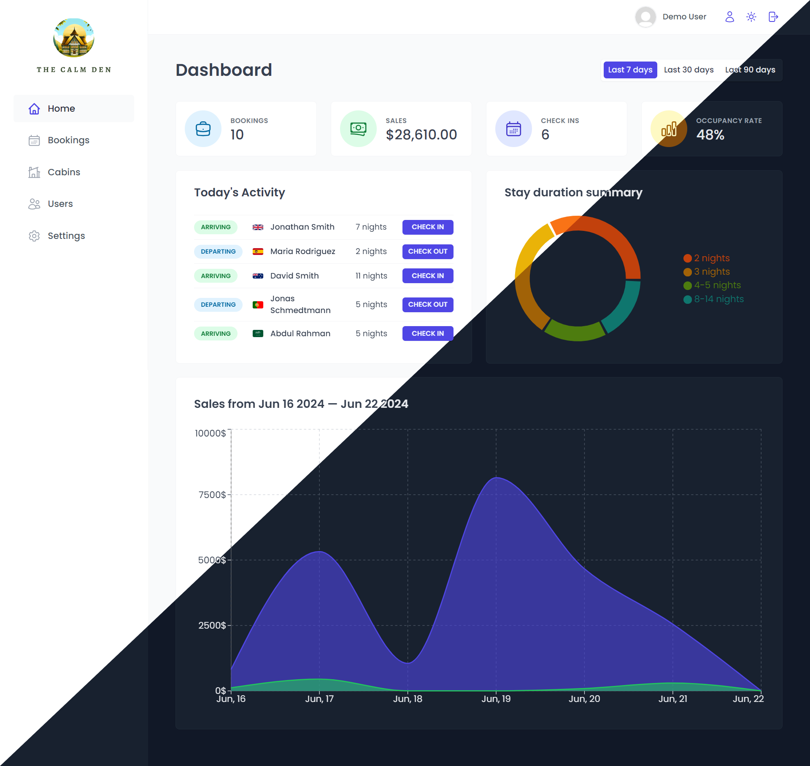

<h1  align="center">The Calm Den</h1>

The Calm Den is a fully-functional React based hotel management web application that enables hotel employees to manage bookings, cabins, and guests. It features an analytics dashboard and also includes a user management system for employee registration. The application uses Supabase for the backend, React Query for remote data handling, and advanced React patterns like Render Props, Compound Component Pattern and React Portals.
 

 

 

## Section Navigation

- [Key Features](#key-features)
- [My Journey with TheCalmDen](#my-journey-with-thecalmden)
  - [Built With](#built-with)
  - [Learnings](#learnings)
- [Author](#author)
- [Acknowledgments](#acknowledgments)

## Key Features

- Users of the app are hotel employees. They need to logged into the application to perfom tasks
- New users can only be signed up inside the applications (to guarantee that only actual hotel employees can get accounts)
- Users should be able to upload an avatar, and change their name and password

- App needs a table view with all cabins, showing the cabin photo, name, capacity, price, and current discount
- Users should be able to update or delete cabin, and to create new cabins (including uploading a photo)

- App needs a table view with all bookings, showing arrival and departure dates, status, and paid amount, as well as cabin and guest data
- The booking status can be “unconfirmed” (booked but not yet checked in), “checked in”, or “checked out”. The table should be filterable by this important status
- Other booking data includes: number of guests, number of nights, guest observations, whether they booked breakfast, breakfast price

- Users should be able to delete, check in, or check out a booking as the guest arrives (no editing necessary for now)
- Bookings may not have been paid yet on guest arrival. Therefore, on check in, users need to accept payment (outside the app), and then confirm that payment has been received (inside the app)
- On check in, the guest should have the ability to add breakfast for the entire stay, if they hadn’t already

- Guest data should contain: full name, email, national ID, nationality, and a country flag for easy identification

- The initial app screen should be a dashboard, to display important information for the last 7, 30, 90 days:

  - A list of guests checking in and out on the current day. Users should be able to perform these tasks from here
  - Statistics on recent bookings, sales, check ins, and occupancy rate
  - A chart showing all daily hotel sales, showing both “total” sales and “extras” sales (only breakfast at the moment)
  - A chart showing statistics on stay durations, as this is important metric for the hotel

- Users should be able to define a few application-wide settings: breakfast price, min and max nights/booking, max guests/booking.
- Dark mode

## My Journey with TheCalmDen

### Built With

- React
- Supabase
- React Query
- React Router
- Styled Components
- React Hook Form
- React Hot Toast
- Recharts
- Vite
- Date-fns

### Learnings

- **React Fundamentals**: I gained a solid understanding of React, encompassing state management, hooks, routing and React's underlying mechanisms, enabling me to create clean and user-friendly interfaces.
- **Authentication & User Management**: I integrated user authentication using Supabase to ensure secure access to hotel employees, and gained knowledge to manage user profiles
- **Settings Management**: I learned how to enable users to modify the application-wide settings, such as breakfast price and booking configurations.
- **Data Modeling**: I leveraged Supabase to design the database structure, creating tables for different entities with their attributes, and building relationships using foreign keys. Additionally, I utilized storage buckets for image handling.
- **Compound Component Pattern**: I employed component compound pattern to build reusable components such as Table and Menus, refining the maintainability of the code
- **Render Props Pattern**: I combined render props pattern with component compound pattern to build highly reusable components, significantly enhancing the flexibility and maintainability of the codebase.
- **Data Visualization**: Recharts enabled integration of various data visualization tools for the analysis of diverse data aspects, and enriching the insights derived from it.
- **Remote Data Handling**: I implemented React Query to fetch and cache data, enabling faster response time and fortifying performance of the application.
- **Form Handling**: I gained proficiency in managing forms using React Hook Form, including data handling, data validation and submission.
- **Clean Notifications**: React Hot Toast incorporated user-friendly notifications for various actions across the application, enhancing the overall user experience.
- **Dark Mode**: The implementation of dark mode enhances the user experience by providing personalized customization options.
- **Project Planning & Management**: I acquired hands-on experience in planning and managing a large scale application encompassing feature development, bug resolution and deployment processes.

### Author

**🧔🏻‍♂️ Onkareshwar Prasad**

- LinkedIn - [@onkareshwar-prasad](https://www.linkedin.com/in/onkareshwar-prasad/)
- Github: [@onkareshwarprasad17](https://github.com/onkareshwarprasad17)

Feel free to reach out with any question or feedback!

## Acknowledgments

This application was developed as part of the [Udemy course](https://www.udemy.com/course/the-ultimate-react-course) by [Jonas Schmedtmann](https://twitter.com/jonasschmedtman). I extend my sincere gratitude to Jonas for his outstanding teaching and continuous guidance during the course.
